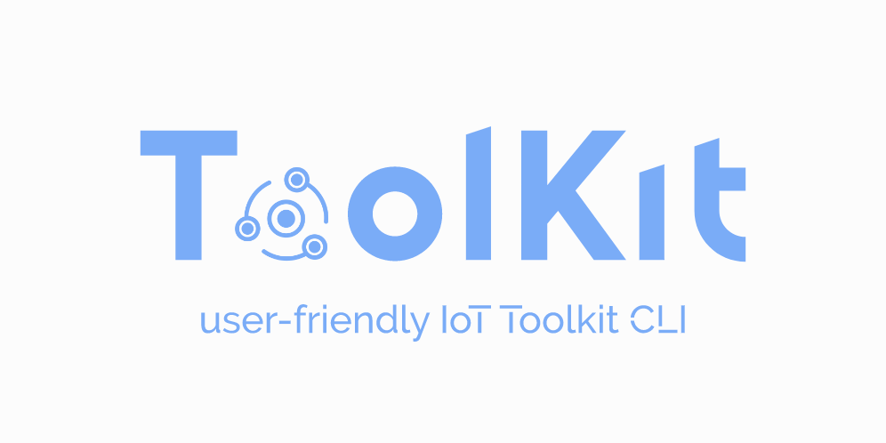
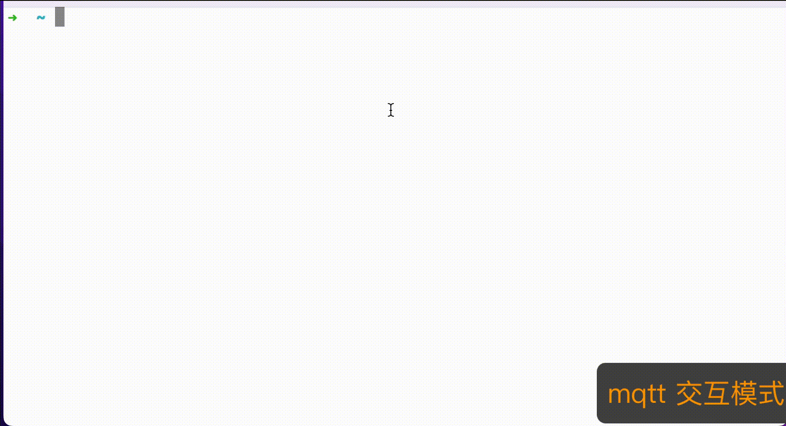

<h2 align="center">
    <a href="https://github.com/IoT-Technology/IoT-Toolkit/wiki" target="blank_">
        
    </a>
    <br>
    ToolKit: 用户友好的IoT协议客户端命令行工具🔧
</h2>

<div align="center">

[](https://github.com/IoT-Technology/IoT-Toolkit/issues)
[](https://github.com/IoT-Technology/IoT-Toolkit/stargazers)


</div>

**Toolkit** 是一款支持多种物联网协议的客户端命令行工具。目前支持**CoAP**、**MQTT**和**NB-IoT**(电信AEP平台、移动OneNET平台)协议，
未来将支持更多的协议。现代化的设计，提供**自动补全**、**多语言配置**且用户交互良好且易于操作。可在**linux**、**unix**和**windows**等操作系统中运行。

<div align="center">



</div>

[📖 English Document](README.md) | 📖 中文文档

----------------------------------------

## 特性

<table style="text-align:center">
  <tr>
    <td width='33%'>
     <h4>&#127932; 集成多种IoT协议</h4>
      <p>支持MQTT、CoAP和NB-IoT协议，未来会支持更多协议，
        更详细的协议打印信息；</p>
    </td>
    <td width='33%'>
     <h4>&#128064; 多操作系统支持</h4>
      可在linux、unix、windows和树莓派上运行；
    </td>
    <td width='33%'>
      <h4>&#127759; 国际化服务</h4>
      多语言配置，中文、英文、德语和法语支持；
    </td>
  </tr>
  <tr>
    <td width='33%'>
      <h4>&#128147; ANSI颜色和样式帮助</h4>
       颜色使命令输出看起来好看，将重要元素与其余部分进行对比，
       减少用户认知负荷；
    </td>
    <td width='33%'>
      <h4>&#128101; 现代化的设计</h4>
      提供自动补全，用户交互良好且易于操作。
    </td>
    <td width='33%'>
      <h4>&#128175; 低内存占用和更快的启动速度</h4>
      静态编译运行避免JIT的CPU开销。使用native image，提供了较快的vm性能和启动速度，
      无需依赖任何运行环境
    </td>
  </tr>
</table>


## 快速开始

### MacOS && Linux

#### HOMEBREW 安装

```bash
brew install iot-technology/tap/toolkit
```

#### SDKMAN安装

安装[SDKMAN!](https://sdkman.io/), 请看[安装文档](https://sdkman.io/install)

```bash
sdk install toolkit
```

### Windows

#### Chocolatey安装

安装[Chocolatey](), 请看[安装教程](https://chocolatey.org/install)

```bash
choco install toolkit
```

### 直接安装

| Platform     | Toolkit                                                                                            |
|--------------|----------------------------------------------------------------------------------------------------|
| Linux-x86_64 | [toolkit-latest-linux-x86_64.zip](https://github.com/IoT-Technology/IoT-Toolkit/releases/latest)   |
| Linux-arm64  | [toolkit-latest-linux-aarch_64.zip](https://github.com/IoT-Technology/IoT-Toolkit/releases/latest) |
| Unix         | [toolkit-latest-osx-x86_64.zip](https://github.com/IoT-Technology/IoT-Toolkit/releases/latest)     |
| Windows      | [toolkit-latest-windows-x86_64.zip](https://github.com/IoT-Technology/IoT-Toolkit/releases/latest) |


## 多语言设置

设置语言为德语，支持

- [x] zh=中文

- [x] de=德语

- [x] en=英语

- [x] fr=法语

```bash
toolkit config -l=de 
```


## IoT协议

### CoAP

https://user-images.githubusercontent.com/23117382/209827565-3a9aa5bb-75a8-42b4-a9d7-66cc4e2ef1dc.mp4

```bash
➜  ~ tookit coap -h
CoAP 客户端工具包
Usage: toolkit coap [-h] [COMMAND]
用户友好的CoAP协议客户端工具包

选项:
  -h, --help   显示帮助信息.
Commands:
  describe, desc   CoAP协议的介绍和描述
  media-types, mt  支持的媒体类型列表
  discover, disc   列出可用的资源
  get              从CoAP资源请求资源
  post             创建/更新CoAP资源中的数据
  put              更新CoAP资源中的数据
  delete, del      删除CoAP资源

```


### MQTT

https://user-images.githubusercontent.com/23117382/209825957-502fa489-6ff3-4f0f-a426-7c2cedc78739.mp4

```bash
➜  ~ toolkit mqtt -h
MQTT 客户端工具包
Usage: toolkit mqtt [-h] [COMMAND]
用户友好的MQTT协议客户端工具包

选项:
  -h, --help   显示帮助信息.
Commands:
  describe, desc  MQTT协议的介绍和描述
  settings, set   MQTT设置信息管理
  publish, pub    向代理发布消息
  subscribe, sub  从MQTT Broker(代理)订阅更新

Copyright (c) 2019-2023, 物联网技术指南
Developed by mushuwei
```


### NB-IoT

https://user-images.githubusercontent.com/23117382/209823597-bafff54f-ec2c-4df6-99d1-5d0ad5719ed8.mp4

```bash
➜  ~ toolkit nb -h
NB-IoT 客户端工具包
Usage: toolkit nb [-h] [COMMAND]
用户友好的 NB-IoT 客户端工具包

选项:
  -h, --help   显示帮助信息.
Commands:
  call            nb-iot 调用入口
  settings, set   nb-iot 配置信息管理
  describe, desc  nb-iot 介绍和描述
```


## 贡献

可以通过解决现有的[Issues](https://github.com/IoT-Technology/IoT-Toolkit/issues)和[ Pull Requests](https://github.com/IoT-Technology/IoT-Toolkit/pulls)来踏入贡献`Toolkit`的第一步。如果您想请求一个特性或者报告bug，请使用提供的模版之一创建GitHub Issue。

## Contributors

这个项目的存在要感谢所有做出贡献的人。[[贡献者](https://github.com/IoT-Technology/IoT-Toolkit/graphs/contributors)].

## License

IoT Toolkit 使用Apache 2.0许可. 详情可看: [LICENSE](https://github.com/IoT-Technology/IoT-Toolkit/blob/main/LICENSE.txt).

## Who is using

这些只是使用 IoT Toolkit 的公司的一部分，仅供参考。如果您正在使用IoT Toolkit, 请在[add your company
here](https://github.com/IoT-Technology/IoT-Toolkit/issues/4) 告诉我们你的方案，使IoT Toolkit更好.

<div style='vertical-align: middle'>
    
    
</div>
